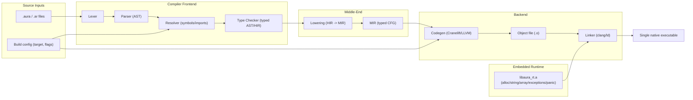
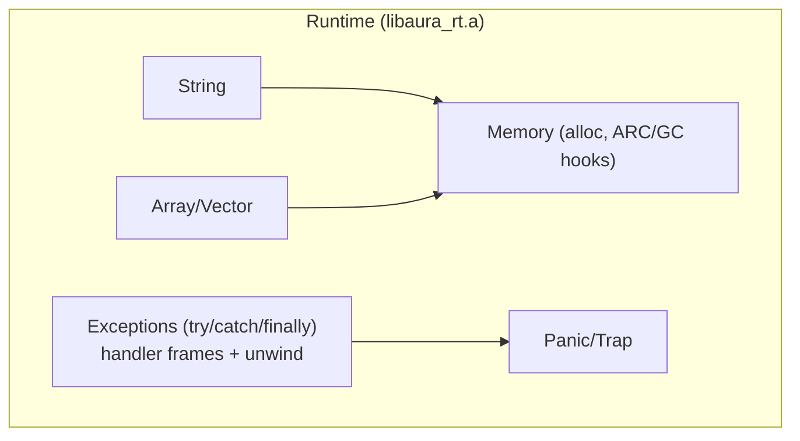

# Aura Architecture (Compiler + Runtime)

Aura is an OOP, statically typed language with a TypeScript-like surface syntax and a Go-like distribution model: `aurac` compiles `.aura` / `.ar` sources into a single native binary that can embed a small runtime (memory management, strings, arrays, panic, etc.).

This document describes a minimal but scalable architecture for the Aura compiler and runtime. The initial implementation focuses on `aarch64-apple-darwin`.

## Current Workspace Snapshot

The repository currently implements the compiler as a Rust workspace with these major crates:

- `aura-ast`, `aura-span`, `aura-diagnostics`
- `aura-lexer`, `aura-parser`, `aura-driver`
- `aura-typeck`, `aura-mir`
- `aura-codegen`, `aura-codegen-llvm`, `aura-codegen-clif`
- `aura-link`, `aurac`, `aura-test-harness`
- `runtime/aura-rt`

Planned crates such as `aura-hir`, `aura-lower`, `aura-target`, and `aura-stdlib` are still future work and should not be treated as present implementation dependencies.

Target note:

- `x86_64-unknown-linux-gnu` is a placeholder target for planning only.
- Do not generate or hardcode support for `x86_64-unknown-linux-gnu` until the target is explicitly promoted in the contract docs and phase plan.
- Target metadata is modeled by a descriptor that records the triple, object format, and support status so the CLI, backend, and linker can share the same policy view.
- Supported targets should be resolved through one stable API (`Target::resolve`) instead of ad hoc string handling in callers.
- Target capability checks should fail fast before code generation or linking when the target is placeholder-only or lacks a known object format.
- Expected unsupported-target diagnostics:
  - placeholder-only targets: `target \`...\` is placeholder-only and cannot be used for code generation yet`
  - unsupported linking: `target \`...\` is placeholder-only and cannot be linked yet`
  - unknown object format: `target \`...\` has an unknown object format and cannot be used for code generation yet` or `... cannot be linked yet`

## Goals

- **Single-binary output**: one executable per build (no external VM required).
- **Embeddable runtime**: runtime ships as a static library linked into the final binary.
- **Fast iteration**: clean separation between frontend (syntax/types) and backend (codegen/link).
- **Multi-target ready**: target-specific pieces are isolated behind clear interfaces.
- **TS-like syntax, OOP semantics**: classes, interfaces, methods, and dynamic dispatch where needed.

## Non-Goals (Initial Milestone)

- Full TypeScript compatibility.
- JIT or bytecode VM.
- Complete standard library.
- Whole-program LTO and advanced optimizations (can be added later).

## High-Level Pipeline

1. **Parse**: source text -> tokens -> AST
2. **Resolve**: names, imports, symbol tables, type names -> resolved AST (or HIR)
3. **Type check**: annotate expressions and declarations with concrete types
4. **Lower**: typed AST/HIR -> MIR (typed, explicit control flow, explicit calls)
5. **Codegen**: MIR -> object file (`.o`) for the selected target
6. **Link**: object + runtime staticlib + system libs -> final executable

## Architecture Diagram

The compiler should support debug/introspection modes:

- `--emit=ast|hir|mir|obj|asm`
- `--print=types|symbols|imports`

## Compiler Components

### Frontend

**Lexer**

- Produces tokens with trivia (comments/whitespace) for diagnostics and tooling.
- Keeps source spans for all tokens.

**Parser**

- Produces an AST closely matching the surface syntax (TS-like).
- Error recovery should be present early (simple "sync points" on `;`, `}`, `)`).

**Diagnostics**

- Centralized diagnostic type: severity + span + message, with optional help/note details.
- Keep the `Diagnostic` field order stable (`severity`, `span`, `message`, `help`, `note`) so formatting and future callers can rely on a predictable shape.
- Stable error codes (useful for editor integration later).

**Module/Package Loader**

- File-based modules: resolves relative `import ... from "./path"` specifiers to files.
- Current MVP resolution order: honor an explicit extension, otherwise try `.aura` and then `.ar`.
- Build root and module roots are explicit CLI options (no hidden magic).

**Name Resolution**

- Builds symbol tables per module.
- Resolves:
  - local bindings
  - type names
  - member lookup
  - imports/exports

**Type System (Minimal)**

- Primitive types (`i32`, `i64`, `f32`, `f64`, `bool`, `string`, `void`).
- Nominal class types.
- Nominal interfaces (initially), with `implements` checks.
- Generics can start as "monomorphize at use sites" (no runtime generics initially).

### Middle-End IR

Use a staged IR design to keep the compiler maintainable:

- **HIR** (optional early): a syntax-lean representation that normalizes sugar (e.g., `for` -> `while`).
- **MIR** (recommended): typed, explicit temporaries, explicit control flow graph (CFG).

MIR should make these explicit:

- control flow blocks + terminators (branch, return, trap)
- calls (direct and virtual)
- object allocation and field access
- string/array operations (lower to runtime calls)

Lowering should preserve source-level semantics while removing surface syntax:

- expressions should evaluate left-to-right unless the operator semantics require a different order
- temporaries should be introduced only to preserve evaluation order or lifetime
- statement and control-flow sugar should become explicit MIR blocks, branches, and cleanup edges
- every exit path should run required cleanups before transferring control, including `return`, `throw`, and `finally`

This makes the backend simpler and keeps "language semantics" largely in the frontend/middle-end.

### Backend

The backend is responsible for:

- target selection (`triple`, `cpu`, `features`, pointer size, calling convention)
- `x86_64-unknown-linux-gnu` remains placeholder-only in the current toolchain; CLI should detect it via host/target selection and fail fast with a clear "not supported yet" message instead of generating code
- object emission
- linking

Current implementation shape:

- `aura-codegen` defines the backend trait and target helper used by the CLI.
- `aura-codegen` also owns the current `TargetDescriptor` model, which captures triple, object format, and support status.
- `aura-codegen` exposes backend capability reporting so the CLI can reject unsupported emit modes before backend construction.
- `aura-codegen-llvm` is the active MVP backend and emits LLVM IR/object code via `inkwell`.
- `aura-codegen-clif` is a placeholder backend crate and should remain non-default until it is intentionally promoted.
- `aura-link` owns the platform linking step.

CLI selection rules:

- `aurac` defaults to LLVM unless `--backend=clif` is requested explicitly.
- `aurac` checks the selected backend's capabilities before compile or emit operations.
- Unsupported emit modes should fail early with a backend-specific diagnostic rather than falling through to code generation.

For the initial milestone on `aarch64-apple-darwin`, a practical approach is:

- Codegen to Mach-O object (`.o`)
- Link via the system toolchain (`clang` / `ld`) into a single executable

Linker strategy notes:

- macOS stays on the system linker path for the MVP so the runtime archive and generated Mach-O object files can be linked without extra tooling.
- Future targets should use the target descriptor to choose a linker policy instead of branching directly in the CLI.
- `aura-link` should remain the only place that knows how to turn target metadata into linker invocations.

Backend should be pluggable:

- `Backend::compile(mir, out_dir) -> ObjectFilePath`
- `Backend::emit_llvm(...)` / `Backend::emit_asm(...)` for debug outputs
- `Linker::link(objects, runtime, target) -> Executable`

Implementation options:

- **LLVM**: MVP backend and the currently implemented backend in this repository.
- **Cranelift**: planned backend; may exist as a placeholder crate before implementation lands.

Keep the abstraction so switching/adding backends is possible. For the current codebase, do not assume Cranelift is available beyond the placeholder wiring, and treat LLVM as the default backend for MVP builds.

## Runtime Architecture (Embedded)

Aura programs link a runtime static library (`libaura_rt.a`) into the final executable. The runtime crate currently builds as `staticlib` plus `rlib` for workspace reuse.

### Responsibilities

- Heap allocation for reference types (class instances, strings, arrays).
- Memory management strategy (choose one for MVP):
  - **ARC (reference counting)**: simpler, deterministic; needs cycle strategy (later) or "no cycles" guidance.
  - **Tracing GC**: more complex; can come later.
- String representation + basic operations.
- Array/vector representation.
- Exception support (throw/try/catch/finally) and unwinding.
- Panic/trap, stack traces (optional in MVP), and exit codes.
- (Later) reflection/RTTI, exceptions, async runtime, etc.

### ABI Between Generated Code and Runtime

Use a stable C ABI boundary:

- Runtime exports `extern "C"` functions with a documented signature.
- Generated code calls these functions directly.

Example runtime entry points (illustrative):

- `aura_alloc(size, align) -> *mut u8`
- `aura_retain(ptr)` / `aura_release(ptr)` (if ARC)
- `aura_string_new_utf8(ptr, len) -> AuraString*`
- `aura_panic(msg_ptr, msg_len) -> !`

This keeps codegen and runtime evolvable independently.

The current runtime implementation already exposes the C ABI used by the compiler for exception unwinding and helper calls, and the public headers live under `runtime/include/`.

The current runtime ABI surface is:

- memory/object lifetime: `aura_alloc`, `aura_retain`, `aura_release`
- exceptions: `aura_try_begin`, `aura_try_end`, `aura_current_exception`, `aura_has_active_handler`, `aura_throw`
- strings and printing: `aura_string_new_utf8`, `aura_string_concat`, `aura_println`
- primitive formatting helpers: `aura_i32_to_string`, `aura_i64_to_string`, `aura_f32_to_string`, `aura_f64_to_string`, `aura_bool_to_string`
- fatal errors: `aura_panic`

The exported header types define the object and handler-frame layout that codegen currently assumes:

- `AuraObject` starts with `vtable` and `ref_count`
- `AuraString` embeds `AuraObject` as its header, then stores `len` and `data`
- `AuraHandlerFrame` carries `prev`, `catch_entry`, `cleanup_stack`, and the jump buffer used by runtime unwinding

Anything not declared in the public header should be treated as provisional until it is added there and documented in the same change.

### Object Layout + Dispatch

For OOP and `extends`:

- Each class instance is a heap object with a header:
  - pointer to vtable (or type descriptor)
  - reference count / GC header (depending on strategy)
- Fields follow in a defined order.

Dynamic dispatch:

- Methods that can be overridden are invoked through the vtable.
- The compiler generates vtables at compile-time (whole-program) for the executable.

Interfaces:

- For MVP, treat interfaces as nominal and lower both class and interface method calls through the same whole-program vtable layout.
- The compiler assigns each method name a stable slot and stores a class-specific vtable pointer in the object header.
- Interface-typed values still use the same object pointer at runtime; the receiver type selects the method signature at call sites while the vtable slot supplies the implementation.

## Exceptions and Unwinding (Go-like, MVP-Friendly)

Aura needs `throw`, `try/catch/finally` with predictable semantics, but early compiler backends (especially non-LLVM) may not provide full "zero-cost" exception handling.

For the MVP, design exceptions as **language-level unwinding implemented by the Aura runtime**, similar in spirit to Go's `panic` + stack unwinding of defers:

- `throw <obj>` raises an exception object.
- The runtime unwinds stack frames until it finds a matching `catch` handler.
- During unwind, the compiler-emitted cleanup actions run (including `finally` blocks and implicit releases for ARC locals).

This approach:

- works without relying on platform-specific C++/DWARF EH tables
- provides deterministic `finally` execution
- integrates cleanly with ARC by treating releases as compiler-emitted cleanups

### Runtime Data Structures

Per-thread, maintain:

- a pointer to the current "handler frame" (linked list)
- the currently thrown exception object (or pointer)

Each handler frame contains:

- link to previous frame
- saved `setjmp` state for the `catch` entry
- cleanup stack pointer for `finally` and compiler-inserted cleanups

### Compiler Lowering Strategy

Frontend lowers `try/catch/finally` to MIR with explicit regions:

- **try region**: pushes a handler frame before executing try-body
- **catch entry**: receives the exception object, does type check, executes handler
- **finally cleanup**: executes on all exits (normal, return, throw)

Important: do not rely on OS-level unwinding to run destructors. Instead, the compiler should insert cleanup code explicitly and ensure it runs on both normal and exceptional edges.

### Backend Integration

Generated code interacts with the runtime via a small C ABI:

- `aura_try_begin(frame_ptr)` / `aura_try_end(frame_ptr)`
- `aura_throw(ex_ptr) -> !`
- `aura_current_exception() -> *mut AuraObject` (optional convenience)

The active `setjmp` site lives in the generated try dispatch or helper layer; `aura_throw` longjmps to the current handler frame, and `aura_try_begin`/`aura_try_end` maintain the per-thread handler list.

### Interop Rules (MVP)

- Exceptions **must not** cross the boundary into foreign (C) code unless explicitly wrapped in an Aura handler frame.
- Runtime guards must abort immediately if `throw` has no active Aura handler to unwind to, rather than propagating into C.
- If an exception escapes `main`, the runtime prints a message and exits non-zero.

Future improvement path:

- Support platform zero-cost EH (LLVM Itanium/DWARF on macOS) under a feature flag.
- Add `throws` annotations and checked exceptions if desired (optional).

## Build + Tooling

### CLI Tooling

- `aurac build` (compile + link)
- `aurac run` (build + run)
- `aurac check` (parse + typecheck only)

### Reproducibility

- Deterministic compilation outputs where feasible.
- Emit a build manifest (inputs, target triple, runtime version).

## Milestones (Suggested)

1. Parse + diagnostics + `aurac check`
2. Type checker for primitives + functions
3. Minimal codegen: `main()` + integer arithmetic + printing (via runtime)
4. Classes + heap allocation + method calls
5. Inheritance + dynamic dispatch
6. Interfaces + `implements`
